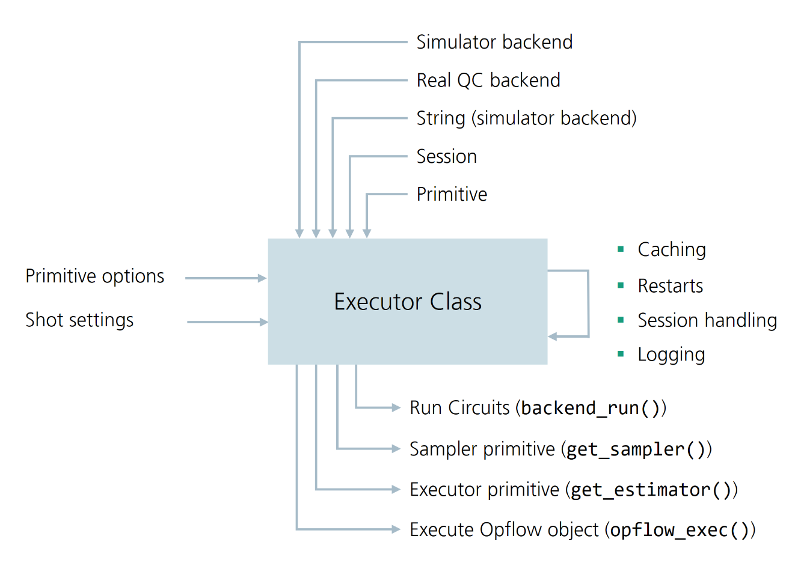

.. _exectutor:

.. currentmodule:: squlearn.Executor

##################
The Executor Class
##################

Overview
--------

The :class:`Executor <squlearn.Executor>` class is the central component of sQUlearn, responsible
for running all quantum jobs.
Both high- and low-level methods utilize the Executor class to execute circuits or other
quantum jobs.
The class provides a high-level interface to the Qiskit simulators and access to IBM
Quantum systems.
It features a variety of comfort features, such as automatic session handling, result caching,
restarts and it automatically creates the necessary Qiskit primitives when they are
required in the sub-program.
The Executor class is also responsible for handling the execution environment, and can be
initialized with a variety of objects that specify the execution environment (see figure below).
The following figure summarizes the structure of the Executor class; ingoing arrows indicate
that the Executor class can be initialized or adjusted with the corresponding object.
Outgoing arrows indicate that the Executor class can return the corresponding object.

Key Features of the Executor
----------------------------

The Executor class provides the following key comfort features when executing a quantum job:

- **Session handling:** Automatically manages the creation and handling of Qiskit sessions.
  If Sessions are time out, the Executor automatically creates a new session and re-executes the
  job.
- **Result caching:** Enables caching of results to avoid redundant job executions, and enable
  restarts of failed executions. Caching is enabled as default only for remote executions.
  The cached files are named after the hash out of different properties of the quantum job,
  that include the backend name, the circuit, the options of the primitive, etc.
  Before running a job, the Executor checks if a cached result exists and returns it if it does.
- **Automatic restarts:** In case the job execution fails or is canceled, the Executor
  automatically resubmits and restarts the job up to a specified number of times.
  The number of restarts can be specified via the ``max_jobs_retries`` argument, the pause
  between restarts can be adjusted by the ``wait_restart`` argument.
- **Logging:** The executor automatically logs all actions to a log file that ca be specified
  via the ``log_file`` argument.
- **Modified Qiskit Primitives:** The Executor allows the creation of modified Qiskit Primitives
  that function similarly to regular primitives but leverage the comfort features mentioned above.
  The primitives can be obtained utilizing the :meth:`get_estimator` and
  :meth:`get_sampler` methods. The modified primitives route all executions through the Executor
  class, and thus benefit from all comfort features. The primitives are fully compatible with
  the Qiskit framework, and can be used in the same way as regular primitives.
  The Executor primitives are automatically utilized in the sQulearn
  sub-programs.

Initialization of the Executor class
------------------------------------

The Estimator can be initialized with various inputs (``execution=``) that specify the 
execution environment:

- A string specifying the simulator backend (e.g., ``"statevector_simulator"`` or
  ``"qasm_simulator"``).

  .. code-block:: python

      from squlearn import Executor
      executor = Executor(execution="statevector_simulator")

  The argument ``execution`` is ommitted in the following examples since it is not necessary,
  if the environment is specified as the first argument.

- A backend following the Qiskit backend standard, e.g. a Qiskit Aer backend, a fake backend,
  a real IBM Quantum backend. This allows in principle the utilization
  of other quantum computing backends as IBM Quantum, as long as they provide a Qiskit backend
  class.

  .. code-block:: python

    from squlearn import Executor
    from qiskit import Aer
    executor = Executor(Aer.get_backend("qasm_simulator"))

- A backend from the Qiskit Runtime Service. 

- A Qiskit backend, typically used to run jobs on IBM Quantum systems or Aer simulators,
    though any backend adhering to Qiskit specifications can be used.
- A QuantumInstance, containing the backend and additional options.
- A QiskitRuntimeService, to execute jobs on the Qiskit Runtime service (in this case,
    the backend must be provided separately via the ``backend=`` argument).
- A pre-initialized Session to execute jobs on the Qiskit Runtime service.
- An Estimator or Sampler primitive (either simulator or Qiskit Runtime primitive).

Options for the Primitives can be provided through the ``options_estimator`` and
``options_sampler`` arguments, but they are also automatically copied from inputted primitives.
