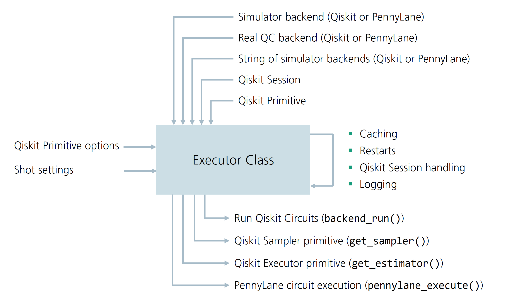

.. _executor_user_guide:

.. currentmodule:: squlearn.Executor

##################
The Executor Class
##################

Overview
--------

The :class:`Executor <squlearn.Executor>` class is the central component of sQUlearn, responsible
for running all quantum jobs.
Both high- and low-level methods utilize the :class:`Executor <squlearn.Executor>` class to execute circuits or to run other
quantum jobs.
The class provides a high-level interface to the simulators of PennyLane and Qiskit,
as well as manages access to real QC hardware as for example IBM Quantum.
It features a variety of comfort features, such as result caching,
automatic restarts of failed jobs, logging of all actions, and Qiskit Session handling.
The :class:`Executor <squlearn.Executor>` class is also responsible for handling the execution environment, and can be
initialized with a variety of objects that specify the execution environment (see figure below).
The following figure summarizes the structure of the :class:`Executor <squlearn.Executor>` class; ingoing arrows indicate
that the :class:`Executor <squlearn.Executor>` class can be initialized or adjusted with the corresponding object.
Outgoing arrows indicate that the :class:`Executor <squlearn.Executor>` class can return the corresponding object.

Key Features of the Executor
----------------------------

The :class:`Executor <squlearn.Executor>` class provides the following key comfort features when executing a quantum job:

- **Result caching:** Enables caching of results to avoid redundant job executions, and enable
  restarts of failed executions. Caching is enabled as default for remote executions, but can also
  be manually activated for local execution.
  The cached files are named after the hash out of different properties of the quantum job,
  that include the backend name, the circuit, the execution options, etc.
  Before running a job, the :class:`Executor <squlearn.Executor>` checks if a cached result exists and returns it if it does.
  The caching can be disabled by setting the ``caching`` argument to ``False``; the folder for
  the cached results can be specified by the ``cache_dir`` argument,
  (default folder: ``"_cache"``).
- **Automatic restarts:** In case the job execution fails or is canceled, the :class:`Executor <squlearn.Executor>`
  automatically resubmits and restarts the job up to a specified number of times.
  The number of restarts can be specified via the ``max_jobs_retries`` argument, the pause
  between restarts can be adjusted by the ``wait_restart`` argument.
- **Logging:** The :class:`Executor <squlearn.Executor>` automatically logs all actions to a log file that ca be specified
  via the ``log_file`` argument.
- **Random Seeds for shot-based simulators:** A random seeds can be specified for the PennyLane
  and Qiskit shot-based simulators / fake backends to make the computations utilizing this :class:`Executor <squlearn.Executor>` object
  reproducible. The random seeds can be set manually by specifying the ``seed`` argument.
- **Modified Qiskit Primitives:** The :class:`Executor <squlearn.Executor>` allows the creation of modified Qiskit Primitives
  that function exactly as the :mod:`Qiskit primitives <qiskit.primitives>` but leverage the comfort features mentioned above.
  The primitives can be obtained utilizing the :meth:`get_estimator` and
  :meth:`get_sampler` methods. The modified primitives route all executions through the :class:`Executor <squlearn.Executor>`
  class, and thus benefit from all comfort features. The primitives are fully compatible with
  the Qiskit framework, and can be used in the same way as regular primitives.
  The :class:`Executor <squlearn.Executor>` primitives are automatically utilized in the sQUlearn
  sub-programs. If the version of the Qiskit installation is larger equal than 1.2, the V2 Primitives are created, otherwise the V1 Primitives are returned.
- **Qiskit Session handling:** Automatically manages the creation and handling of Qiskit IBM Runtime sessions.
  If Sessions are time out, the :class:`Executor <squlearn.Executor>` automatically creates a new session and re-executes the
  job. Note that a manual closing of the session is reuqired when running in jupyter notebook, since otherwise unncessary runtime on the IBM Quantum Machines might be a consequence.
- **Automatic backend selection (IBM Quantum only):** The :class:`Executor <squlearn.Executor>` class can automatically select the most suitable
  backend for the quantum job. The selection process is facilitated by the `mapomatic <https://github.com/qiskit-community/mapomatic>`_ tool `[1]`_.
  The :class:`Executor <squlearn.Executor>` can be initialized with a list of backends, a :class:`QiskitRuntimeService <qiskit_ibm_runtime.QiskitRuntimeService>`, or a Qiskit
  Session, and the most suitable backend is chosen automatically. The selection process can be
  set to two modes: ``"quality"`` and ``"speed"``.
- **In-QPU parallelization (Qiskit only):** The :class:`Executor <squlearn.Executor>` class supports QPU (Quantum Processing Unit)
  parallelization for Qiskit backends, enabling simultaneous measurements of the same quantum
  circuit on the quantum hardware by duplicating the circuit.

Initialization of the Executor class
------------------------------------

The Estimator can be initialized with various inputs (``execution=``) that specify the
execution environment:

- Default initialization with no backend specified: If no backend is specified, the :class:`Executor <squlearn.Executor>`
  class is initialized utilizing PennyLane's :class:`DefaultQubit <pennylane.devices.default_qubit.DefaultQubit>` simulator.
  If no shots are specified (``shots=None``) the simulator is utilized as a statevector simulator by default. If shots are specified, a shot-based simulator is utilized.

  .. jupyter-execute::

      from squlearn import Executor
      # Initialize the Executor with the PennyLane statevector simulator
      # as default, shots=None (statevector simulator)
      executor = Executor()

      # Initialize the Executor with the PennyLane shot-based simulator
      executor = Executor(shots=1234)

- A string specifying the local simulator backend: Qiskit's :class:`AerSimulator <qiskit_aer.AerSimulator>` is available by providing ``"qiskit"``,
  ``"statevector_simulator"`` and  ``"qasm_simulator"``; PennyLane's :class:`DefaultQubit <pennylane.devices.default_qubit.DefaultQubit>` simulator can be initialized by
  ``"pennylane"`` or ``"default.qubit"``. Note that with Qiskit version 1.2, the sampler routines will always performe shots for the ``"statevector_simulator"`` keyword.

  .. jupyter-execute::

      from squlearn import Executor
      # Initialize the Executor with the statevector simulator
      executor = Executor("statevector_simulator")

      # Initialize the Executor with the qasm simulator
      executor = Executor("qasm_simulator", shots=1234)

      # Initialize the Executor with qiksit is equivalent to "statevector_simulator"
      executor = Executor("qiskit")

      # Initialize the Executor with the PennyLane statevector simulator
      executor = Executor("pennylane")

      # Initialize the Executor with the PennyLane shot-based simulator
      executor = Executor("default.qubit", shots=1234)

- A Qiskit :class:`Backend <qiskit.providers.Backend>`, e.g. a :class:`AerProvider <qiskit_aer.AerProvider>` backend or a :mod:`fake_provider <qiskit_ibm_runtime.fake_provider>` backend. This allows also the utilization
  of other quantum computing backends, as long as they provide a Qiskit :class:`Backend <qiskit.providers.Backend>` class.

  .. jupyter-execute::

    from squlearn import Executor
    from qiskit_aer import Aer
    from qiskit_ibm_runtime.fake_provider import FakeManilaV2

    # Executor with the Aer statevector simulator
    executor = Executor(Aer.get_backend("aer_simulator"))

    # Executor with the FakeManilaV2 backend
    executor = Executor(FakeManilaV2())

- A PennyLane device of a quantum computing backend obtained with :func:`pennylane.device`. In the following example, the :class:`Executor <squlearn.Executor>` is
  initialized with a AWS device. Note that this example requires the PennyLane AWS plugin to be
  installed (``pip install amazon-braket-pennylane-plugin``) and the AWS credentials to be
  configured. A full list of plugins for PennyLane can be found `here <https://pennylane.ai/plugins/#plugins>`_.

  .. code-block:: python

    from squlearn import Executor
    import pennylane as qml

    # Initialize the Executor with the PennyLane default.qubit device
    dev = qml.device("braket.aws.qubit", device_arn="arn:aws:braket:::device/quantum-simulator/amazon/sv1", wires=2)
    executor = Executor(dev, shots = 1234)

- A :class:`Backend <qiskit.providers.Backend>` from :class:`QiskitRuntimeService <qiskit_ibm_runtime.QiskitRuntimeService>`'s :meth:`backend <qiskit_ibm_runtime.QiskitRuntimeservice.backend>` method, which utilizes the execution of quantum jobs on IBM Quantum.
  Sessions and Primitives are automatically created and managed by the :class:`Executor <squlearn.Executor>` class (remember to close the session at the end of your code when running on IBM Quantum).

  .. code-block:: python

    from squlearn import Executor
    from qiskit_ibm_runtime import QiskitRuntimeService

    service = QiskitRuntimeService(channel="ibm_quantum", token="INSERT_YOUR_TOKEN_HERE")
    executor = Executor(service.backend('ibm_brisbane'))
    ...
    # Close the session at the end of your code
    executor.close_session()

  It is also possible to pass a list of IBM Quantum backends from which the most suited backend is chosen
  automatically (see :ref:`Automatic backend selection <autoselect>`)

- Another way is to just pass the :class:`QiskitRuntimeService <qiskit_ibm_runtime.QiskitRuntimeService>` to the :class:`Executor <squlearn.Executor>`. In this case, the backend
  will be chosen automatically, for more details see :ref:`Automatic backend selection <autoselect>`.

  .. code-block:: python

    from squlearn import Executor
    from qiskit_ibm_runtime import QiskitRuntimeService

    service = QiskitRuntimeService(channel="ibm_quantum", token="INSERT_YOUR_TOKEN_HERE")
    executor = Executor(service)

- A pre-initialized :class:`Session <qiskit_ibm_runtime.Session>` object, which can be used to execute quantum jobs on the :class:`QiskitRuntimeService <qiskit_ibm_runtime.QiskitRuntimeService>`.

  .. code-block:: python

    from squlearn import Executor
    from qiskit_ibm_runtime import QiskitRuntimeService

    service = QiskitRuntimeService(channel="ibm_quantum", token="INSERT_YOUR_TOKEN_HERE")
    session = service.create_session(backend = service.backend('ibm_brisbane'))
    executor = Executor(session)
    ...
    executor.close_session()

- Pre-configured Primitive (:class:`Estimator <qiskit_ibm_runtime.Estimator>`, :class:`Sampler <qiskit_ibm_runtime.Sampler>`) with options for error mitigation.
  Note that the options from an :class:`Estimator <qiskit_ibm_runtime.Estimator>` are not automatically copied to
  the :class:`Sampler <qiskit_ibm_runtime.Sampler>`, and vice versa.

  .. code-block:: python

    from squlearn import Executor
    from qiskit_ibm_runtime import QiskitRuntimeService, Estimator

    service = QiskitRuntimeService(channel="ibm_quantum", token="INSERT_YOUR_TOKEN_HERE")

    session = service.create_session(backend = service.backend('ibm_brisbane'))
    estimator = Estimator(session=session)
    estimator.options.resilience.zne_mitigation = True
    estimator.options.resilience.zne.noise_factors = (1, 3, 5)
    estimator.options.resilience.zne.extrapolator = "linear"

    executor = Executor(estimator)
    ...
    executor.close_session()

- If only the ``backend.run`` execution is wanted, this can be achieved by utilizing the
  Qiskit IBM Provider package. However, most sQUlearn algorithms a build upon primitives,
  and therefore, this access is not recommended, since it is likely to be deprecated in the future.

  .. code-block:: python

    from squlearn import Executor
    from qiskit_ibm_provider import IBMProvider

    IBMProvider.save_account(token="INSERT_YOUR_TOKEN_HERE")
    provider = IBMProvider(instance="hub/group/project")
    executor = Executor(provider.get_backend("ibmq_qasm_simulator"))

The following code shows an example for configuring the :class:`Executor <squlearn.Executor>` class with a
backend from the :class:`QiskitRuntimeService <qiskit_ibm_runtime.QiskitRuntimeService>` and setting options for caching, logging and restarts:

.. code-block:: python

    from squlearn import Executor
    from qiskit_ibm_runtime import QiskitRuntimeService

    service = QiskitRuntimeService(channel="ibm_quantum", token="INSERT_YOUR_TOKEN_HERE")

    options = {"resilience":{"zne_mitigation"  : True,
                             "zne":{"noise_factors" : (1, 3, 5),"extrapolator":"linear" }}
              }

    executor = Executor(service.backend('ibm_brisbane'), # Specify the backend
                         cache_dir='cache', # Set cache folder to "cache"
                         caching=True, # Enable caching default for remote executions
                         log_file="executor.log", # Set-up logging file
                         wait_restart=600,  # Set 10 min pause between restarts of Jobs
                         max_jobs_retries=10, # Set maximum number of restarts to 10 before aborting
                         options_estimator=options # Set options for the Estimator primitive
                         )

    executor.set_shots(1234) # Shots can be adjusted after initialization

Utilizing Executor Primitives in Qiskit Routines
-------------------------------------------------

The :class:`Executor <squlearn.Executor>` class provides an :class:`ExecutorEstimator <squlearn.util.executor.ExecutorEstimator>` and :class:`ExecutorSampler <squlearn.util.executor.ExecutorSampler>` primitive that are compatible with the
Qiskit framework. This is only possible, in case the :class:`Executor <squlearn.Executor>` class is initialized with a backend
compatible with Qiskit (and not PennyLane). The primitives can be obtained by the
:meth:`get_estimator` and :meth:`get_sampler` methods of the :class:`Executor <squlearn.Executor>` class.
The primitives automatically utilized the parent :class:`Executor <squlearn.Executor>` class for all executions,
and thus benefit from all comfort features of the :class:`Executor <squlearn.Executor>`.

The following example shows, how to evaluate the Quantum Fisher Information utilizing the
:class:`ExecutorEstimator <squlearn.util.executor.ExecutorEstimator>` primitive (see `QFI in Qiskit <https://qiskit-community.github.io/qiskit-algorithms/stubs/qiskit_algorithms.gradients.QFI.html>`_)
The following code runs only for a Qiskit version below 1.2, since the QFI Routines have not been updated to PrimitivesV2 yet.

  .. code-block::

      from squlearn import Executor
      from qiskit_algorithms.gradients import LinCombQGT, QFI
      from qiskit.quantum_info import Pauli
      # Executor initialization (other ways are possible, see above)
      executor = Executor(execution="statevector_simulator")
      # This creates the QFI primitive that utilizes the Estimator of the Executor class
      qfi = QFI(LinCombQGT(executor.get_estimator()))
      # Quantum Fischer Information can be evaluated as usual with qfi.run()

If only the run function of the :class:`Executor <squlearn.Executor>` Primitive is wanted, this can be achieved by utilizing the :class:`Executor <squlearn.Executor>` class function :meth:`estimator_run_v1` and :meth:`sampler_run_v1` for V1 Primitives.
If the Qiskit version is larger than 1, also the functions :meth:`estimator_run_v2` and :meth:`sampler_run_v2` are available with the V2 Primitive interface.

Note that the attributes :meth:`estimator` and :meth:`sampler` of the :class:`Executor <squlearn.Executor>` class are
not creating or referring to the :class:`Executor <squlearn.Executor>` primitives! Instead, they refer to the
Qiskit Primitives used internally that do not utilize any caching, restarts, etc.

Setting Options for Qiskit Primitives
--------------------------------------

Options for the Primitives can be provided as a :class:`Options <qiskit_ibm_runtime.options.Options>` object to the ``options_estimator`` and
``options_sampler`` arguments, but they are also automatically copied from inputted primitives.
They folow the same dictionary datastructure than the original V2 Primtives.

.. code-block:: python

    from squlearn import Executor
    from qiskit_ibm_runtime import QiskitRuntimeService

    service = QiskitRuntimeService(channel="ibm_quantum", token="INSERT_YOUR_TOKEN_HERE")

    options = {"resilience":{"zne_mitigation"  : True,
                             "zne":{"noise_factors" : (1, 3, 5),"extrapolator":"linear" }}
              }

    executor = Executor(service.backend("ibm_brisbane"),options_estimator=options)

Alternatively, the options can be adjusted by the attributes :meth:`estimator_options` and :meth:`sampler_options` similar
to the option interface of the V2 Primtives:

.. code-block:: python

    from squlearn import Executor
    from qiskit_ibm_runtime import QiskitRuntimeService

    service = QiskitRuntimeService(channel="ibm_quantum", token="INSERT_YOUR_TOKEN_HERE")
    executor = Executor(service.backend("ibm_brisbane"))
    executor.sampler_options.dynamical_decoupling.enable = True
    executor.sampler_options.dynamical_decoupling.sequence_type = "XpXm"

Options can be adjusted by the :meth:`set_options` method of the Primitives that are created by the
:class:`Executor <squlearn.Executor>` class.

.. code-block:: python

    from squlearn import Executor
    from qiskit_ibm_runtime import QiskitRuntimeService, Options

    service = QiskitRuntimeService(channel="ibm_quantum", token="INSERT_YOUR_TOKEN_HERE")

    executor = Executor(service.backend("ibm_brisbane"))
    estimator = executor.get_estimator()
    estimator.set_options(resilience_level=2)

.. _autoselect:

Automatic backend selection (IBM Quantum only)
----------------------------------------------

sQUlearn offers automatic determination of the most suitable Qiskit backend for the
Quantum Machine Learning (QML) problem. This is facilitated by initializing the :class:`Executor <squlearn.Executor>` with a
list of supported backends, which includes real IBM backends or simulated fake backends.
Alternatively, users can pass a :class:`QiskitRuntimeService <qiskit_ibm_runtime.QiskitRuntimeService>`, where all appropriate backends
are automatically considered. The selection process leverages the mapomatic tool `[1]`_ and also
identifies the best transpilation for each backend.

Two modes for backend selection are currently implemented:

* ``"quality"``: This mode automatically selects the best backend, which is also the default
  setting. An estimation of the expected error is calculated for the optimal
  transpiled circuit of the QML model. Backend selection is performed by the
  mapomatic tool.

* ``"speed"``: In this mode, the backend with the smallest queue is automatically selected.

Once a backend is chosen, it remains fixed throughout the program unless explicitly changed.
It's worth noting that if other QML models are initialized, the chosen backend remains
consistent. The backend selection can be unset using the unset_backend method.
However, it's important to note that this action only triggers the selection process for
QML models initialized thereafter.

Below is an example demonstrating the selection of different simulated noisy IBM backends.
We set up a small :class:`QNNRegressor <squlearn.qnn.QNNRegressor>` example and train it on the most suitable backend:

.. jupyter-execute::

   import warnings
   import numpy as np
   from qiskit_ibm_runtime.fake_provider import FakeManilaV2, FakeBelemV2, FakeAthensV2
   from squlearn.util import Executor
   from squlearn.qnn import QNNRegressor
   from squlearn.observables import SummedPaulis
   from squlearn.encoding_circuit import ChebyshevPQC
   from squlearn.optimizers import Adam
   from squlearn.qnn.loss import SquaredLoss

   backends = [FakeBelemV2(), FakeAthensV2(), FakeManilaV2()]
   executor = Executor(backends, shots=10000)
   qnn = QNNRegressor(
       ChebyshevPQC(2, 1),
       SummedPaulis(2),
       executor,
       SquaredLoss(),
       Adam({'maxiter':2}), # Two iteration for demonstration purposes only
       callback=None # Remove print of the progress bar for cleaner output
   )
   with warnings.catch_warnings():
      warnings.simplefilter("ignore")
      qnn.fit(np.array([[0.25],[0.75]]),np.array([0.25,0.75]))
   print("Chosen backend:", executor.backend)

In the following example, the service is used for initializing the :class:`Executor <squlearn.Executor>`, and
the mode is switched to ``"speed"``. The :class:`Executor <squlearn.Executor>` is then utilized for running a
:class:`QKRR <squlearn.kernel.QKRR>` in which the backend is chosen automatically.

.. code-block:: python

   import numpy as np
   from squlearn import Executor
   from qiskit_ibm_runtime import QiskitRuntimeService
   from squlearn.encoding_circuit import ChebyshevRx
   from squlearn.kernel import FidelityKernel, QKRR

   # Executor is initialized with a service, and considers all available backends
   # (except simulators)
   service = QiskitRuntimeService(channel="ibm_quantum", token="INSERT_YOUR_TOKEN_HERE")
   executor = Executor(service, auto_backend_mode="speed")

   # Create a QKRR model with a FidelityKernel and the ChebyshevRx encoding circuit
   qkrr = QKRR(FidelityKernel(ChebyshevRx(4,1),executor))

   # Backend is automatically selected based on the smallest queue
   # All the following functions will be executed on the selected backend
   X_train, y_train = np.array([[0.1],[0.2]]), np.array([0.1,0.2])
   qkrr.fit(X_train, y_train)

In-QPU parallelization (Qiskit only)
------------------------------------

The :class:`Executor <squlearn.Executor>` class supports QPU (Quantum Processing Unit) parallelization for Qiskit backends, enabling simultaneous
measurements of the same quantum circuit on the quantum hardware by duplicating the circuit.
This feature significantly enhances the efficiency of quantum computation by reducing the number
of required shots.
However, it's essential to note that utilizing QPU parallelization may introduce additional noise
and hardware errors due to increased qubit utilization and crosstalk.

The QPU parallelization parameter ``qpu_parallelization`` determines the number of parallel
evaluations of the Quantum Circuit on the QPU. When ``qpu_parallelization`` is set to an :py:class:`int`
value, it specifies the exact number of parallel executions, for instance:

.. code-block:: python

   executor = Executor(..., qpu_parallelization=4)

This configuration instructs the :class:`Executor <squlearn.Executor>` to duplicate all circuit executions four times and
execute them concurrently on the QPU.

Alternatively, setting ``qpu_parallelization`` to ``"auto"`` enables automatic determination of
the parallelization level. In this mode, the :class:`Executor <squlearn.Executor>` dynamically adjusts the degree of
parallelization to maximize the number of possible parallel circuit measurements, for example:

.. code-block:: python

   executor = Executor(..., qpu_parallelization="auto")

If activated, QPU parallelization is automatically applied to all Primitives created by the
:class:`Executor <squlearn.Executor>`. By leveraging QPU parallelization, users can expedite the execution of quantum
circuits on real hardware. Nonetheless, it's crucial to weigh the benefits against the potential
drawbacks of increased noise and errors. By default, ``qpu_parallelization`` is set to ``None``,
implying no parallelization is considered unless explicitly specified.
The transpilation considers the duplicated circuits, hence the duplicated circuits are placed
accordingly to the qubit layout of the backend.
In principle, this feature can be used in combination with the automatic backend selection,
but the backend selection process might take a substantial time due to the increased number of
circuits that need to be transpiled.

.. seealso::

   * :class:`Executor <squlearn.Executor>`
   * `Qiskit Runtime <https://docs.quantum.ibm.com/api/qiskit-ibm-runtime>`_
   * `Qsikit Primitives <https://docs.quantum.ibm.com/api/qiskit/primitives>`_
   * `Mapomatic: Automatic mapping of compiled circuits to low-noise sub-graphs <https://github.com/qiskit-community/mapomatic>`_
   * `PennyLane Devices <https://docs.pennylane.ai/en/stable/code/api/pennylane.device.html>`_

.. rubric:: References

_`[1]` P. D. Nation and M. Treinish "Suppressing quantum circuit errors due to system variability".
`PRX Quantum 4(1) 010327 <https://journals.aps.org/prxquantum/abstract/10.1103/PRXQuantum.4.010327>`_ (2023)
