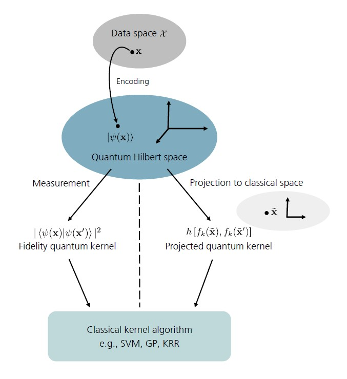

.. _quantum_kernel_methods:

.. currentmodule:: squlearn.kernel

######################
Quantum Kernel Methods
######################

Quantum Kernel Methods are among the most promising approaches to (supervised) Quantum Machine
Learning (QML). This is due to the fact that it has been shown [1] that they can be formally
embedded into the rich mathematical framework of classical kernel theory. The key idea in kernel
theory is to solve the general task of machine learning, i.e. finding and studying patterns in data,
in a high dimensional feature space - the reproducing kernel Hilbert space (RKHS) - where the
original learning problem attains a trivial form. The mapping from the original space to the RKHS
(which in general can be infinite-dimensional) is done by so called encoding circuits. The RKHS is
endowed with an inner product which provides access to the high dimensional space without the need
to ever explicitly calculate the high- (infinite-) dimensional feature vectors. This is known as
the *kernel trick*: the encoding circuit and the inner product define a kernel function and vice versa,
via

:math:`K(x,y) = \Braket{\phi(x), \phi(y)}`

Due to the inner product, the kernel function formally computes the distance between data points
:math:`x` and :math:`y` and thus effectively reduces to the illustrative interpretation of a
similarity measure between data points.

The key point of Quantum Kernel methods is that they can be fundamentally formulated as a classical
kernel method whose kernel is computed by a quantum computer. By using a quantum computer for the
calculation of the kernel one naturally exploits the inherent quantum mechanical phenomena of
*superposition* and *entanglement* - a fact which holds out the prospect of designing machine
learning models that are able to deal with complex problems that are out of reach for conventional
machine learning methods.

Quantum Kernel methods work analogously to their classical counterparts, with data embedded into
the exponentially increasing quantum Hilbert space via a quantum encoding circuit

:math:`\ket{\psi(x,\boldsymbol{\theta})} = U_{\boldsymbol{\theta}}(x)\ket{0}`

with :math:`U_{\boldsymbol{\theta}}(x)` a parametrized quantum circuit for data encoding applied
to the initial qubit state :math:`\ket{0}` (as discussed below, trainable parameters can be
introduced to optimally align a resulting quantum kernel to a given data set). This fundamental
ansatz marks the bridge between QML and kernel methods. But for this to hold, we need to define the
data encoding density matrices

:math:`\rho(x,\boldsymbol{\theta})=\ket{\psi(x,\boldsymbol{\theta})}\bra{\psi(x,\boldsymbol{\theta})}`

as the feature "vectors". Therefore, we can consider the space of complex density matrices
enriched with the *Hilbert-Schmidt inner product* as the feature space of a quantum model and
state [1]. In the quantum computational practice, the Hilbert-Schmidt inner products are revealed by
measurements. Consequently, in quantum computing, access to the Hilbert space of quantum states is
given by measurements.

.. _figure 1:

    **Figure 1** Schematic illustration of the function principle of quantum kernel methods, which can be formally embedded in the rich
    mathematical framework of conventional kernel theory. Data points  :math:`\symbf{x}` are mapped to the quantum Hilbert space by
    encoding them into a quantum state  :math:`\ket{\symbf{\psi}(\symbf{x})}`. Access to the quantum Hilbert space is granted by
    measurements. :math:`\symbf{Left:}` In quantum mechanics measurements are expressed through Hilbert-Schmidt inner products. 
    Quantum kernels, which are defined using this fidelity-type metric are thus referred to as fidelity quantum kernels (FQKs).
    More on FQKs in sQUlearn will be discussed below. :math:`\symbf{Right:}` When projecting the quantum states to an approximate
    classical representation using, e.g., reduced physical observables this gives rise to a family of projected quantum kernels (PQKs).
    These will be also subject to discussion in the sQUlearn context below.

.. currentmodule:: squlearn.kernel

High-Level methods that employ quantum kernels
----------------------------------------------
In general, kernel methods refer to a collection of pattern analysis algorithms that use kernel
functions to operate in a high-dimensional feature space. Probably, the most famous representative
of these kernel-based algorithms is *Support Vector Machines (SVMs)*. Kernel methods are most
commonly used in supervised learning frameworks for either classification or regression tasks.

In the NISQ era (no access to fast linear algebra algorithms such as HHL), the basic notion of
quantum kernel methods is to merely compute the kernel matrix with a quantum computer and
subsequently pass it to an conventional kernel algorithms. For this task, sQUlearn provides a
convenient workflow by either wrapping the corresponding scikit-learn estimators or by
independently implementing them analogously, adapted to the needs of quantum kernel methods.
sQUlearn offers SVMs for both classification (QSVC) and regression (QSVR) tasks, Gaussian
Processes (GPs) for both classification (QGPC) and regression (QGPR) tasks as well as a
quantum kernel ridge regression routine (QKRR).

Classification
##############

In terms of classification algorithms, sQUlearn provides:

.. autosummary::
   :nosignatures:

   QSVC
   QGPC

We refer to the documentations and examples of the respective methods for in-depth information
and user guidelines.

Regression
##########

In terms of regression algorithms, sQUlearn provides:

.. autosummary::
   :nosignatures:

   QSVR
   QKRR
   QGPR

We refer to the documentations and examples of the respective methods for in-depth information
and user guidelines.

Methods to evaluate quantum kernels
-----------------------------------
sQUlearn provides two methods to evaluate quantum kernels: Fidelity Quantum kernels (FQKs) and
Projected Quantum kernels (PQKs), which also represent the standard approaches to quantum kernel
methods in the literature.

Central to both approaches is the embedding of data into the quantum Hilbert space by using
quantum encoding circuits, which are nothing but encoding quantum circuits. These can optionally be
parametrized (as already implicitly introduced above) for optimally adjusting the resulting
quantum kernel to a given data set. If a encoding circuit with trainable parameters is used, sQUlearn
initializes them to some predefined and reasonable values, which can be controlled, within FQK
*and* PQK definitions via the argument :code:`parameter_seed` (defaults to zero).

Beyond that, for both FQKs and PQKs, sQUlearn provides the option for regularizing the respective
kernel matrices using either *thresholding* or *tikhonov* approach as described in Ref. [2].
Regularization is by default switched of but can be set via the :code:`regularization`
argument.

.. currentmodule:: squlearn.kernel.lowlevel_kernel

Fidelity Quantum Kernel (FQK) via :class:`FidelityKernel`
#########################################################

The straightforward and natural way to the definition of a quantum kernel [1,3-5], is to use the
*native geometry of the quantum state space* which is inherent in the *Hilbert-Schmidt inner product*,
i.e.

:math:`k^Q(x,x^\prime)=\mathrm{tr}[\rho(x,\boldsymbol{\theta})\rho(x^\prime,\boldsymbol{\theta})]`

which, for pure states, reduces to

:math:`k^Q(x,x^\prime)=\left|\Braket{\psi(x,\boldsymbol{\theta})|\psi(x^\prime, \boldsymbol{\theta})}\right|^2`,

i.e. a *fidelity-type metric*. From this, it immediately follows that evaluating the FQK scales
quadratically in the data set size. Therefore, the applicability of FQKs is naturally restricted to small data set
instances.

In sQUlearn a FQK (instance) can be defined as shown by the following example:

.. jupyter-execute::

    from squlearn.util import Executor
    from squlearn.encoding_circuit import ChebyshevPQC
    from squlearn.kernel import FidelityKernel
    enc_circ = ChebyshevPQC(num_qubits=4, num_features=1, num_layers=2)
    fqk_instance = FidelityKernel(
        encoding_circuit=enc_circ,
        executor=Executor()
    )

When evaluating kernels on a real backend, sQUlearn provides an option for mitigating FQKs for
with respect to depolarizing noise using the approach discussed in Ref. [2]. The respective
mitigation technique uses the fact that ideally (train-train or test-test) kernel matrices
should consist exclusively of ones along the diagonal - a property which is by construction
fulfilled by PQKs. For FQKs one can attempt to restore this property using the
:code:`mit_depol_noise` argument which can be either set to :code:`'msplit'` or :code:`'mmean'`
as defined in Ref. [2]. By default this option is set to :code:`None`.

Projected Quantum Kernel (PQK) via :class:`ProjectedQuantumKernel`
##################################################################

Several works show that with increasing problem size, the FQK approach suffers from
*exponential concentration* leading to quantum models that suffer from untrainability.
To circumvent this problem, Ref. [4] introduced a family of *projected quantum kernels*
as a solution. These work by projecting the quantum states to an approximate classical
representation by using, e.g., reduced physical observables.

The default PQK implementation of sQUlearn is one of the simplest forms of PQKs. They work by
measuring the one-particle reduced density matrix (1-RDM) on all qubits for the encoded state
and define the kernel as (RBF-inspired)

:math:`k^{PQ}(x,x^\prime)=\exp\left(-\gamma\sum_k\sum_{P\in\lbrace X,Y,Z\rbrace}\left[\mathrm{tr}(P\rho(x,\boldsymbol{\theta})_k) - \mathrm{tr}(P\rho(x^\prime,\boldsymbol{\theta})_k)\right]^2\right)`

where :math:`\rho(x,\boldsymbol{\theta})_k=\mathrm{tr}_{j\neq k}\left[\rho(x,\boldsymbol{\theta})\right]`
refers to the 1-RDM, which is the partial trace of the quantum state
:math:`\rho(x,\boldsymbol{\theta})=\ket{\psi(x,\boldsymbol{\theta})}\bra{\psi(x,\boldsymbol{\theta})}`
over all qubits except for the :math:`k`-\ :spelling:word:`th` qubit. After some lines of algebra, it can be seen that
these :math:`\mathrm{tr}` arguments are nothing but expectation values for measuring the Paulis
:math:`X,Y,Z` on each qubit in the state :math:`\ket{\psi(x,\boldsymbol{\theta})}` and thus can be
viewed as QNNs. The definition of PQKs is ambiguous. This concerns the outer form of the kernel, i.e.
the function into which the QNN is put, the choice of observables used to evaluate the QNN
as well as their respective locality, which eventually reflects in the order of RDMs used in the
definition. Currently, sQUlearn implements different outer forms :math:`f(\cdot)`, which represent
standard scikit-learn kernel functions (`Gaussian`, `Matern`, `ExpSineSquared`, `RationalQuadratic`,
`DotProduct`, `PariwiseKernel`), i.e. generally speaking, sQUlearn provides PQKs of the form

:math:`k^{PQ}(x,x^\prime) = f\left[QNN(x), QNN(x^\prime)\right]`

A respective PQK (instance) referring to the definition given above is defined as illustrated by
the following example:

.. jupyter-execute::

    from squlearn.util import Executor
    from squlearn.encoding_circuit import ChebyshevPQC
    from squlearn.kernel import ProjectedQuantumKernel
    enc_circ = ChebyshevPQC(num_qubits=4, num_features= 1, num_layers=2)
    pqk_instance = ProjectedQuantumKernel(
        encoding_circuit=enc_circ,
        executor=Executor(),
        measurement='XYZ',
        outer_kernel='gaussian'
    )

Moreover, the QNNs can be evaluated with respect to different observables, where in
addition to the default setting - :code:`measurement='XYZ'` - one can specify :code:`measurement='X'`,
:code:`measurement='Y'` and :code:`measurement='Z'` for one-qubit measurements with respect to only
one Pauli operator. Beyond that, one can also specify an observable or a list of observables, see the
respective examples in :class:`ProjectedQuantumKernel` or the :doc:`./observables`
user guide.

Training of quantum kernels
---------------------------

As mentioned above, the definition of quantum kernels (both FQK and PQK) relies quantum encoding circuits
that are represented through parametrized quantum circuits (PQC). This results in quantum kernels
that contain trainable parameters to optimally adjust to a given learning problem. The trainable
parameters are obtained from classical optimization loops which attempt to minimize a given loss
function.

sQUlearn implements the kernel target alignment procedure as well as the Negative-Log-Likelihood.
At the same time it provides several optimizers such as :code:`Adam` and :code:`SLSQP`;
This can be achieved by employing the :class:`KernelOptimizer` class which automatically
enables the optimization of quantum kernels when used in the high-level methods.

The following examples assume that you have some data set available which you previously split into
training and test data and shows how to optimize kernels.

**Example - Kernel Target Alignment**

    .. code-block:: python

        from squlearn.util import Executor
        from squlearn.encoding_circuit import ChebyshevPQC
        from squlearn.optimizers import Adam
        from squlearn.kernel import ProjectedQuantumKernel, KernelOptimizer, QKRR
        from squlearn.kernel.loss import TargetAlignment

        # set up the encoding circuit
        encoding_circuit = ChebyshevPQC(num_qubits=4, num_features=1, num_layers=2)

        # set up the quantum kernel
        pqk_instance = ProjectedQuantumKernel(encoding_circuit, Executor())

        # set up the optimizer
        adam_opt = Adam(options={"maxiter":100, "lr": 0.1})

        # define KTA loss function
        kta_loss = TargetAlignment()

        # set up the kernel optimizer
        kernel_optimizer = KernelOptimizer(quantum_kernel=pqk_instance, loss=kta_loss, optimizer=adam_opt)

        # initialize the QKRR model with the kernel optimizer
        qkrr = QKRR(kernel_optimizer)

        # Simple example
        x_train = [[0.1], [0.2], [0.3], [0.4], [0.5]]
        y_train = [0.1, 0.2, 0.3, 0.4, 0.5]
        qkrr.fit(X=x_train, y=y_train)

.. rubric:: References

[1] `M. Schuld, "Supervised quantum machine learning models are kernel methods". arXiv:2101.11020v2 (2021). <http://arxiv.org/abs/2101.11020v2>`_

[2] `T. Hubregtsen et al., "Training Quantum Embedding Kernels on Near-Term Quantum Computers". arXiv:2105.02276v1 (2021). <https://arxiv.org/abs/2105.02276>`_

[3] `M. Schuld and N. Killoran, "Quantum Machine Learning in feature Hilbert spaces". Phys. Rev. Lett. 112(4), 040504 (2019). <https://journals.aps.org/prl/abstract/10.1103/PhysRevLett.122.040504>`_

[4] `S. Jerbi et al., "Quantum machine learning beyond kernel methods". arXiv:2110.13162v3 (2023) <https://arxiv.org/abs/2110.13162>`_

[5] `H. Y. Huang et al., "Power of data in quantum machine learning". Nat. Commun. 12, 2631 (2021). <https://www.nature.com/articles/s41467-021-22539-9>`_