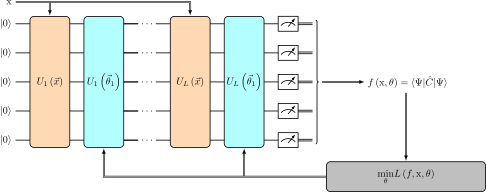

.. _quantum_neural_networks:

.. currentmodule:: squlearn.qnn

=======================
Quantum Neural Networks
=======================

Quantum Neural Networks (QNNs) extend the concept of artificial neural networks into the realm of
quantum computing. Typically, they are constructed by encoding input data into a quantum state
through a sequence of quantum gates. This quantum state is then manipulated using trainable
parameters and utilized to evaluate an expectation value of an observable that acts as the output
of the QNN. This output is then used to calculate a loss function, which is subsequently
minimized by a classical optimizer. The resultant QNN can then be employed to predict outcomes
for new input data.

In many cases, QNNs adhere to a layered design, akin to classical neural networks, as illustrated
in `figure_qnn 1`_. However, it is essential to note that they do not adhere to the concept of
neurons as seen in classical neural networks. Therefore, the term "Quantum Neural Network" may
be somewhat misleading, as QNNs do not conform to the traditional neural network paradigm.
Nevertheless, their application domain closely resembles that of classical neural networks,
which explains the established nomenclature.

.. _figure_qnn 1:

    **Figure 1** Layered design of a QNN with alternating encoding (orange) and parameter (blue) layers.
    The QNN is trained in a hybrid quantum-classical scheme by optimizing the QNN's parameters
    :math:`{\theta}` for a given cost function :math:`L`.

In principle, the design of QNN architectures offers a high degree of freedom.
Nevertheless, most common designs follow a layered structure, where each layer comprises an
encoding layer denoted as :math:`U_i({x})` and a parameterized layer represented as
:math:`U_i({\theta})`. The encoding layers map the input data, :math:`{x}`, to a quantum state of
the qubits, while the parameterized layers are tailored to modify the mapped state.

The selection of the encoding method depends on the specific problem and the characteristics of
the input data, whereas parameterized layers are explicitly designed to alter the mapped state.
Furthermore, entanglement among the qubits is introduced, enabling the QNN to process information
in a more intricate and interconnected manner. Finally, we repeatedly measure the resulting state,
denoted as :math:`\Psi({x}, {\theta})`, to evaluate the QNN's output as the expectation value:

.. math::
    f({x}, {\theta}) = \langle\Psi({x}, {\theta}) \lvert\hat{C}({\theta})
    \rvert\Psi({x}, {\theta}) \rangle

Here, :math:`\hat{C}({\theta})` represents a operator, also called observable, for each output
of the QNN. While the observable can be freely selected, it often involves operators based on a
specific type of Pauli matrices, such as the Pauli Z matrix, to simplify the
evaluation of the expectation.

It's worth noting that both the embedding layers :math:`U_i({x})` and the observable
:math:`\hat{C}` may also contain additional trainable parameters.

To train Quantum Neural Networks (QNNs), a hybrid quantum-classical approach is employed.
The training process consists of two phases: quantum circuit evaluation and classical optimization
(as illustrated in `figure_qnn 1`_).

In the quantum circuit evaluation phase, the QNN and its gradient with respect to the parameters
are assessed using a quantum computer or simulator. The gradient can be obtained using the
parameter-shift rule. Subsequently, in the classical optimization phase, an appropriate
classical optimization algorithm is employed to update the QNN's parameters.
This iterative process is repeated until the desired level of accuracy is attained.

Commonly used classical optimizers, such as SLSQP (for simulators) or stochastic gradient
descent, like Adam, are applied in the classical optimization stage of QNN training.
They adjust the QNN's parameters to minimize a predefined cost function, denoted as :math:`L`:

.. math::
    \min_{\theta} L(f, {x}, {\theta})

The specific form of the cost function depends on the problem that the QNN is designed to solve.
For instance, in a regression problem, the cost function is often defined as the mean squared
error between the QNN's output and the target value.

High-level methods for QNNs
====================================

In this section, we will illustrate the process of constructing a QNN using sQUlearn.
A QNN is composed of two main components: an encoding circuit, which is essentially a
parameterized quantum circuit, and a cost operator.

In sQUlearn, we have dedicated classes for these components: :class:`EncodingCircuit`
and :class:`CostOperator`, both of which we will utilize in the upcoming example.

In the following cell, we will build an encoding circuit based on the Chebyshev input encoding
method:

.. jupyter-execute::

    from squlearn.encoding_circuit import ChebyshevPQC

    pqc = ChebyshevPQC(num_qubits = 4, num_features = 1, num_layers = 2)
    pqc.draw("mpl")

There are several alternative encoding circuits at your disposal in sQUlearn, which you can
explore in the user guide located at :ref:`quantum_encoding_circuits`.

The second ingredient is to specify an observable for computing the QNN's output. In this
particular example, we employ a summation over a Pauli Z observable for each qubit,
along with a constant offset:

.. jupyter-execute::

    from squlearn.observables import SummedPaulis

    op = SummedPaulis(num_qubits=4)
    print(op)

Other expectation operators can be found in the user guide on :ref:`user_guide_observables`.

Now we can construct a QNN from the encoding circuit and the cost operator.
sQUlearn offers two easy-to-use implementation of QNNs, either for regression or classification:

.. autosummary::
   :nosignatures:

   QNNClassifier
   QNNRegressor

We refer to the documentations and examples of the respective classes for in-depth information.

In the following example we will use a :class:`QNNRegressor`, the encoding circuit, and
the observable as defined above. Additionally, we utilize the mean squared error loss function
and the Adam optimizer for optimization.

.. code-block:: python

    from squlearn.observables import SummedPaulis
    from squlearn.encoding_circuit import ChebyshevPQC
    from squlearn.qnn import QNNRegressor, SquaredLoss
    from squlearn.optimizers import Adam
    from squlearn import Executor

    op = SummedPaulis(num_qubits = 4)
    pqc = ChebyshevPQC(num_qubits = 4, num_features = 1, num_layers = 2)
    qnn = QNNRegressor(pqc, op, Executor(), SquaredLoss(), Adam())

The QNN can be trained utilizing the :meth:`fit <squlearn.qnn.QNNRegressor.fit>` method:

.. code-block:: python

    import numpy as np
    # Data that is inputted to the QNN
    x_train = np.arange(-0.5, 0.6, 0.1)
    # Data that is fitted by the QNN
    y_train = np.square(x_train)

    qnn.fit(x_train, y_train)

The inference of the QNN is calculated using the
:meth:`predict <squlearn.qnn.QNNRegressor.predict>` method:

.. code-block:: python

    x_test = np.arange(-0.5, 0.5, 0.01)
    y_pred = qnn.predict(x_test)

Optimization
============

sQUlearn offers a lot of possibilities to train a QNN's parameters. In this
section we will show, how to use :class:`SLSQP <squlearn.optimizers.optimizers_wrapper.SLSQP>`,
as an example for a wrapped scipy optimizer, and :class:`Adam <squlearn.optimizers.adam.Adam>`
with mini-batch gradient descent to optimize the loss function.

SLSQP
-----

sQUlearn offers wrapper functions, :class:`SLSQP <squlearn.optimizers.optimizers_wrapper.SLSQP>`
and :class:`LBFGSB <squlearn.optimizers.optimizers_wrapper.LBFGSB>`, for scipy's SLSQP and
L-BFGS-B implementations as well as the wrapper function
:class:`SPSA <squlearn.optimizers.optimizers_wrapper.SPSA>` for Qiskit's SPSA implementation.
We show how to import and use :class:`SLSQP <squlearn.optimizers.optimizers_wrapper.SLSQP>`
in the following code block, other optimization methods can be used analogously.

.. code-block:: python

    from squlearn.optimizers import SLSQP

    ...
    slsqp = SLSQP(options={"maxiter": 100})
    ...
    reg = QNNRegressor(
        ...
        optimizer=slsqp,
        ...
    )

With this configuration, :class:`QNNRegressor` will use scipy's
:func:`minimize <scipy.optimize.minimize>` function with ``method="SLSQP"``.
The wrapper Class :class:`SLSQP <squlearn.optimizers.optimizers_wrapper.SLSQP>`
allows to specify hyper parameters in a :class:`dict` that get passed on to the function.

Mini-Batch gradient descent with Adam
-------------------------------------

sQUlearn's QNN classes, :class:`QNNRegressor` and :class:`QNNClassifier`, also offer the
possibility to use mini-batch gradient descent with Adam to optimize the model. This allows for
training on bigger data sets. Therefore we import and use the
:class:`Adam <squlearn.optimizers.adam.Adam>` optimizer as demonstrated in the following
code block.

.. code-block:: python

    from squlearn.optimizers import Adam

    ...

    adam = Adam(options=options_dict)

    ...

    reg = QNNRegressor(
        ...
        optimizer=adam,
        ...
        batch_size=batch_size,
        epochs=epochs,
        shuffle=True,
        ...
    )

Using SGD optimizers like the :class:`Adam <squlearn.optimizers.adam.Adam>` optimizer allows us
to specify further hyper parameters such as ``batch_size``, ``epochs`` and ``shuffle``.
The parameters ``batch_size`` and ``epochs`` are positive numbers of type :class:`int` and
``shuffle`` is a :class:`bool` which specifies, whether data points are shuffled before each epoch.

Schedule of the learning rate of Adam
-------------------------------------

Sometimes it can be beneficial to adjust the learning rate of the optimizer during the training.
This is possible by providing a :class:`List` or a :class:`Callable` to the learning rate option
``lr`` of the :class:`Adam <squlearn.optimizers.adam.Adam>` optimizer.
Then a learning rate is chosen from the list or calculated by the callable at the beginning of
each iteration or epoch.
A suitable function for generating a callable with an exponential decay of the learning rate is
provided by :meth:`util.get_lr_decay`. The following example will generate an Adam optimization
with an exponential decay in the learning rate from 0.01 to 0.001 over 100 iterations.

.. jupyter-execute::

    from squlearn.optimizers import Adam
    from squlearn.qnn.util import get_lr_decay
    adam = Adam({'lr':get_lr_decay(0.01, 0.001, 100)})

Dynamically adjustments of the shots
-------------------------------------

It is possible to adjust the number of shots for the gradient evaluation. The number of
shots are calculated from the relative standard deviation (RSTD) of the Loss function :math:`L`.
Objective is that the RSTD should be smaller than a given threshold :math:`\beta`.

.. math::
    \text{RSTD}(L) = \frac{\sqrt{\frac{\sigma_L^2}{N_\text{shots}}}}{L} < \beta

The high-level implementations of QNNs, :class:`QNNRegressor` and :class:`QNNClassifier`,
can be initialized with a shot controller that takes care to automatically adjust the number of
shots. The following example will generate a :class:`QNNRegressor`
with a RSTD threshold of 0.1 and a minimum and maximum number of shots of 100 and 10000.
It utilizes the :class:`ShotsFromRSTD <squlearn.qnn.util.ShotsFromRSTD>` shot controller.

.. code-block:: python

    from squlearn.qnn import QNNRegressor
    from squlearn.qnn.util import ShotsFromRSTD
    reg = QNNRegressor(
        ...
        shot_controller = ShotsFromRSTD(rstd_bound=0.1, min_shots=100, max_shots=10000),
        ...
    )

Together with the variance reduction described in the next section, this allows to reduce the
number of shots in the early stages of the optimization significantly and
increase them in the later stages when a higher accuracy is required.

Variance reduction
==================

When evaluating a pretrained QNN on Qiskit's :class:`QasmSimulator <qiskit_aer.QasmSimulator>` or
on real hardware, the model output will be subject to randomness due to the finite number of shots.
The noise level of the model thus depends on its variance, which can be calculated as

.. math::

    \sigma_f^2 = \langle\Psi\lvert\hat{C}^2\rvert\Psi\rangle -
    \langle\Psi\lvert\hat{C}\rvert\Psi\rangle^2 \text{.}

`Figure_qnn 3`_ shows the output of a :class:`QNNRegressor` fit to a logarithm
with :class:`SquaredLoss <squlearn.qnn.loss.SquaredLoss>` evaluated on Qiskit's
:class:`QasmSimulator <qiskit_aer.QasmSimulator>`.
The model has been trained with a noise-free simulator, but evaluating it on a noisy simulator
yields a high variance in the model output.

.. _figure_qnn 2:
.. plot::
    :caption: **Figure 2** Logarithm and output of :class:`QNNRegressor` :math:`f(\theta, x)` evaluated on Qiskit's
              :class:`QasmSimulator <qiskit_aer.QasmSimulator>`. The QNN output has a high variance.
    :align: center

    import numpy as np
    import matplotlib.pyplot as plt
    from squlearn import Executor
    from squlearn.encoding_circuit import ChebyshevRx
    from squlearn.observables import IsingHamiltonian
    from squlearn.qnn import QNNRegressor, SquaredLoss
    from squlearn.optimizers import SLSQP
    nqubits = 4
    number_of_layers = 2
    pqc = ChebyshevRx(nqubits, 1, num_layers=number_of_layers)
    exe = Executor("pennylane", seed=0)
    exe.set_shots(5000)
    ising_op = IsingHamiltonian(nqubits, I="S", Z="S", ZZ="S")
    param = np.array([ 0.91858145, -1.1163345,   0.38467092,  1.39597102,  1.10224011,  2.41369111,
    1.64968778, -0.81903595,  0.4867727,   0.38505193,  1.10635672,  0.72867129,
    -1.74881862, -0.64411871,  0.86344117, -0.91471452])
    param_op = np.array([-0.47157523,  5.10755673,  2.63075629])
    qnn = QNNRegressor(pqc, ising_op, exe, SquaredLoss, SLSQP(), param, param_op, pretrained=True)
    x = np.arange(np.min(0.1), np.max(0.8), 0.005).reshape(-1, 1)
    y = qnn.predict(x)
    plt.plot(x, np.log(x))
    plt.plot(x, y)
    plt.title("QNN inference without variance regularization")
    plt.legend([r"$\log(x)$", r"$f(\theta, x)$"])
    plt

We can mitigate this problem by adding the models variance to the loss function
:math:`L_\text{fit}` and thus regularizing for variance. We do this by setting the `variance`
keyword in the initialization of the :class:`QNNRegressor` (or :class:`QNNClassifier`) with a
hyper-parameter :math:`\alpha`.

.. code-block:: python

    reg = QNNRegressor(
        ...
        variance = alpha,
        ...
    )

The new total loss function reads as

.. math::

    L_\text{total} = L_\text{fit} +
    \alpha \cdot \sum_k \lVert \sigma_f^2 ( x_i )\rVert \text{,}

where :math:`\sigma_f^2( x_i )` is the variance of the QNN on the training data
:math:`\{x_i\}`.

The regularization factor :math:`\alpha` controls the influence of the variance regularization on
the total loss. It can be either set to a constant :class:`float` or a :class:`Callable` that
takes the keyword argument ``iteration`` to dynamically adjust the factor. Values between
:math:`10^{-2}` and :math:`10^{-4}` have shown to yield satisfying results. `[1]`_

Evaluation on Qiskit's :class:`QasmSimulator <qiskit_aer.QasmSimulator>` now yields less variance
in the model, as depicted in `figure_qnn 3`_.

.. _figure_qnn 3:
.. plot::
    :caption: **Figure 3** Logarithm and output of :class:`QNNRegressor` :math:`f(\theta, x)`, trained with variance
              regularization, evaluated on Qiskit's :class:`QasmSimulator <qiskit_aer.QasmSimulator>`.
              The QNN output has a low variance.
    :align: center

    import warnings
    import numpy as np
    import matplotlib.pyplot as plt
    from squlearn import Executor
    from squlearn.encoding_circuit import ChebyshevRx
    from squlearn.observables import IsingHamiltonian
    from squlearn.qnn import QNNRegressor, SquaredLoss
    from squlearn.optimizers import SLSQP
    nqubits = 4
    number_of_layers = 2
    pqc = ChebyshevRx(nqubits, 1, num_layers=number_of_layers)
    exe = Executor("qasm_simulator")
    exe.set_shots(5000)
    ising_op = IsingHamiltonian(nqubits, I="S", Z="S", ZZ="S")
    param = np.array([ 3.41062806,  0.63125445,  4.40119971,  1.25919873, -2.35420942, -0.04354262,
    -4.22612537, -0.19520602,  0.21838745,  0.78754811,  3.05189136,  0.59189901,
    -0.52783347, -1.55477309, -2.08338942, -0.29088459])
    param_op = np.array([-1.57350653,  0.87778247, -0.26884315])
    qnn = QNNRegressor(pqc, ising_op, exe, SquaredLoss, SLSQP(), param, param_op, pretrained=True)
    x = np.arange(np.min(0.1), np.max(0.8), 0.005).reshape(-1, 1)
    with warnings.catch_warnings():
        warnings.simplefilter("ignore")
        y = qnn.predict(x)
    plt.plot(x, np.log(x))
    plt.plot(x, y)
    plt.title("QNN inference with variance regularization")
    plt.legend([r"$\log(x)$", r"$f(\theta, x)$"])
    plt

Variance reduction with dynamic adjustment of the regularization factor
-----------------------------------------------------------------------

Furthermore it is possible to adjust the variance regularization factor dynamically during the
optimization. This allows for example to prioritize the minimization of the variance in the early
stages of the optimization and then focus on the minimization of the loss function in the later
stages (see Ref. [1]). This can be achieved by passing a :class:`List` or a :class:`Callable`
to the keyword argument ``variance`` of the :class:`QNNRegressor` (or :class:`QNNClassifier`).
The following example will generate a :class:`QNNRegressor` with a variance
regularization factor that is adjusted dynamically during the optimization by utilizing the
function :meth:`util.get_variance_fac`. The set-up features a final regularization factor of 0.005,
a decay factor of 0.08 and a plateau at :math:`\alpha=1` of 20 iterations at the beginning.

.. code-block:: python

    from squlearn.qnn import QNNRegressor
    from squlearn.qnn.util import get_variance_fac
    reg = QNNRegressor(
        ...
        variance = get_variance_fac(0.005,0.08,20),
        ...
    )

.. rubric:: References

_`[1]` D. A. Kreplin and M. Roth "Reduction of finite sampling noise in quantum neural networks".
`arXiv:2306.01639 <https://arxiv.org/abs/2306.01639>`_ (2023).
