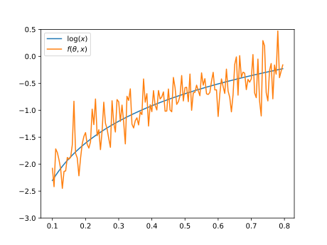
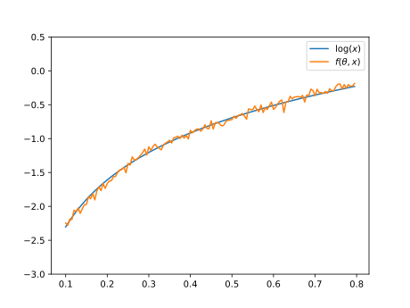

.. _quantum_neural_networks:

.. currentmodule:: squlearn.qnn

=======================
Quantum Neural Networks
=======================

Quantum Neural Networks (QNNs) are a type of machine learning model that combine the principles of quantum computing and neural networks. They are usually built using a alternating layered structure, as depicted in :numref:`fig_qnn`, which is reminiscent of a classical deep neural network and thus gives them their name. The layers alternate between encoding- and parameterized layers.

.. _fig_qnn:
.. figure:: ../_static/qnn/qnn.svg
    :alt: Quantum Neural Network (QNN)
    :width: 600
    :align: center

    Layered design of a QNN with alternating encoding (orange) and entangling (blue) layers. The QNN is trained in a hybrid quantum-classical scheme by optimizing the QNN's parameters :math:`\vec{\theta}` for a given cost function :math:`L`.

Encoding layers are responsible for mapping the input data to the quantum state of the qubits. They encode the input features into the amplitudes or other properties of the quantum state. The choice of encoding depends on the specific problem and the nature of the input data. Parameterized layers are designed to alter the mapped state and introduce entanglement among the qubits, enabling the QNN to process information in a more complex and interconnected manner. They typically consist of quantum gates that, as the name states, create entanglement between different qubits. Examples of commonly used entangling gates include the Controlled-Z gate, Controlled-X gate, or other two-qubit gates. Finally we measure the resulting state :math:`\rho\left(\vec{x}, \vec{\theta}\right)` repeatedly to be able to calculate the expectation value :math:`\hat{C}=\operatorname{tr}\left\{\rho\left(\vec{x}, \vec{\theta}\right)O\right\}` of some observable :math:`O`.

Both, the encoding layers :math:`U_i\left(\vec{\theta}, \vec{x}\right), i=1,\dots,L` and the entangling layers :math:`U_i\left(\vec{\theta_i}\right), i=1,\dots,L`, as well as the measurement operators :math:`O`, can contain trainable parameters :math:`\vec{\theta}`. 

To train QNNs, a hybrid quantum-classical scheme is used. The training process involves two steps: quantum circuit evaluation and classical optimization (compare :numref:`fig_qnn`). In the quantum circuit evaluation step, the QNN is evaluated on a quantum computer or simulator to generate the output. The classical optimization step involves using a fitting classical optimization algorithm to update the parameters of the QNN based on the difference between the expected output and the actual output obtained from the quantum circuit execution. This process is repeated iteratively until the desired level of accuracy is achieved. 

Classical optimizers, such as SLSQP or stochastic gradient descent, are commonly used in the classical optimization step of training QNNs. They update the parameters of the QNN to minimize the program

.. math::
    \min_\vec{\theta} L\left(f, \vec{x}, \vec{\theta}\right)

according to a defined cost function :math:`L`. The cost function represents the discrepancy between the expected output and the actual output obtained from the QNN evaluation.

High-Level methods for QNNs
===========================

sQUlearn offers easy-to-use implementation of QNNs for regression and classification.

.. autosummary::
   :nosignatures:

   QNNClassifier
   QNNRegressor

We refer to the documentations and examples of the respective classes for in-depth information and user guidelines.

Optimization
============

To train a QNN's parameters, sQUlearn offers a lot of possibilities for modification. In this section we will show, how to SLSQP, as an example for a scipy optimizer, and ADAM with mini-batch gradient descent to optimize the loss function.

SLSQP
-----

Using SLSQP as the optimizer is probably the easiest way to optimize a QNNs parameters. The optimizer is simply imported, created and used like in the following code block.

.. code-block:: python

    from squlearn.optimizers import SLSQP
    
    ...

    optimizer = SLSQP()
    
    ...

    reg = QNNRegressor(
        feature_map,
        operator,
        executor,
        loss,
        optimizer,
        param_ini,
        param_op_ini
    )

Mini-Batch gradient descent with ADAM
-------------------------------------

sQUlearn's QNN classes, :class:`QNNRegressor` and :class:`QNNClassifier`, also offer the possibility to use mini-batch gradient descent to optimize the model. This allows for training on bigger data sets.

Variance reduction
==================

When evaluating a pretrained QNN on Qiskit's QasmSimulator or on real hardware, the model will be subject to randomness due to the inherent nature of quantum mechanics. The overall performance of the model thus depends on its variance, which can be calculated as

.. math::

    \sigma_f^2 = \langle\Psi\lvert\hat{C}^2\rvert\Psi\rangle - \langle\Psi\lvert\hat{C}\rvert\Psi\rangle^2 \text{.}

.. _fig_qnn_output_high_var:

    Logarithm and output of :class:`QNNRegressor` :math:`f(\theta, x)` evaluated on Qiskit's QasmSimulator. The QNN output has a high variance.

We can add the models variance to the loss function by setting the `variance` keyword in the initialization of the :class:`QNNRegressor` (or :class:`QNNClassifier`).

.. code-block:: python

    reg = QNNRegressor(
        ...
        variance = alpha,
        ...
    )

.. _fig_qnn_output_low_var:

    Logarithm and output of :class:`QNNRegressor` :math:`f(\theta, x)` evaluated on Qiskit's QasmSimulator. The QNN output has a low variance.
