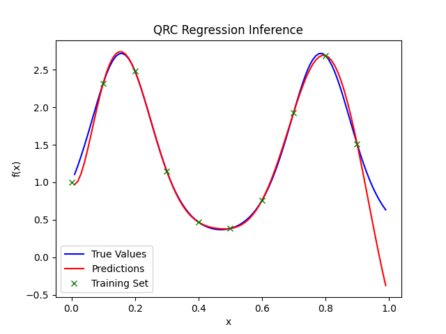

.. _quantum_reservoir_computing:

.. currentmodule:: squlearn.qrc

===========================
Quantum Reservoir Computing
===========================

Reservoir Computing (RC) in general leverages a fixed, randomly connected network structure called the 'reservoir.'
This is in strong contrast to conventional deep learning architectures, which performe the optimization of weight across all layers.
In RC, the reservoir enables dynamic, nonlinear transformations of input data into a high-dimensional feature space, followed by linear regression to produce the output.
Quantum Reservoir Computing (QRC) tries to take advantage of the exponential scaling dimension of the Hilbert space in the quantum computing context 
to potentially provide an advantage over the classical RC. In QRC there is a register of accessable qubits :math:`\rho_0`, which are subject to
encoding the classical information and measurements, and hidden qubits :math:`\rho_{\mathrm{hid}}`, which are related to the reservoir and 
artifically raise the dimension, the reservoir dynamic acts on, by the size of the hidden register. The hidden qubits can either be provided by an additional register
or interaction with the enviroment.

First the classical input data :math:`x=\lbrace x^{(i)}\rbrace_{i=1}^D`, where :math:`D` denotes the samplesize, gets related to a unitary 
evolution :math:`U(x)`, called encoding circuit, that evolves the initial state of the accessable qubits :math:`\rho_0` to 

.. math::
    \rho(x)=U(x)\rho_0U(x)^{\dagger}.

Afterwards the reservoir dynamic :math:`U_R`  gets applied to the composite of the accessable and hidden qubits, i.e

 .. math::
    \tilde{\rho}(x)=U_R(\rho(x)\otimes \rho_{\mathrm{hid}})U_R^{\dagger}=U_R(U(x)\rho_0U(x)^{\dagger}\otimes \rho_{\mathrm{hid}})U_R^{\dagger}.

Now using a set of (usually randomized) observables :math:`\lbrace O_1, \ldots, O_M \rbrace` the respective expecation-
values

.. math::
    \langle O_j \rangle_x = \mathrm{Tr}(O_j \tilde{\rho}(x))

are deteremined by measurements for all :math:`j = 1 ,\ldots,M`. The resulting vector 

.. math::
    \symbf{v}(x):= \begin{bmatrix}\langle O_1 \rangle_x\\\vdots\\\langle O_M \rangle_x\end{bmatrix}

can be used to perform classical machine learning algorithms like linear regression. So the key advantage over QNN is
that one does not optimize over the weights of a complex parametrized quantum circuit, but keeps the complex part fix and later 
optimizes the readout vectors via cheaper algorithms.

.. _figure_qrc 1:

    **Figure 1** An example of a quantum reservoir computing circuit (see Ref. [1]). In the graphic we set the hidden qubits :math:`\rho_{\mathrm{hid}}` as :math:`\ket{000}`.
    The encoding circuit (orange) and the quantum reservoir (blue) evolve the initial accessable qubit register :math:`\ket{\rho_0}` and
    the composite of accessable and hidden qubits respectively. After the measurement with respect to the observable :math:`O_k` we can
    repeat with similar circuits for all the other observables and use the expectation values to do classical machine learning.

Note that in sQUlearn, there is no hidden qubit register available in the pre-configured encoding circuits. This can be constructed manually if needed, or if run on a 
quantum computer, it may be due to the (non-controllable) interaction with the surrounding bath.

With the outputs of our QRC circuit we construct the so called readout vector 

.. math::
    \symbf{v}^*(x)= \symbf{w}^\top \symbf{v}(x) = \sum\limits^M_{j=1} \symrm{w}_j \cdot \langle O_j \rangle_x,

where :math:`\symbf{w}^\top = (\symrm{w}_1, \ldots, \symrm{w}_M)`, and the task of classical maschine learning is to determine the best collection of weights :math:`\symrm{w}_j`. This can 
be done, for example, using a pseudo inverse method.

High-level methods for QRC
===========================

As already mentioned the expectation values :math:`\langle O_j \rangle_x` will be used to carry out a classical maschine learning model. Usually one sticks to linear
regression, since the complexity is transmitted to the reservoir. Nonetheless sQUlearn provides some additional options to choose from. 

With sQUlearn it is possible to use QRC to do regression and classification tasks:

.. autosummary::
   :nosignatures:

   QRCClassifier
   QRCRegressor

By passing either of both classes a fitting keyword argument ``mlp`` (multi-layer perceptron model), ``linear`` (linear model or single layer perceptron for classification) or 
``kernel`` (support vector maschine) one can set the desired maschine learning model. 
We will now go step by step through the implementation of an example QRC for both methods with sQUlearn. 

Classification
===============

Setup
-----

First an foremost the encoding of the classical data onto the accessable qubits and the quantum reservoir preparation
is done in sQUlearn by the :class:`EncodingCircuit` class. For details we refer to the documentations and examples in the user guidelines.

.. jupyter-execute::

    from squlearn.encoding_circuit import ChebyshevPQC

    pqc = ChebyshevPQC(num_qubits=8, num_features=2, num_layers=2)
    pqc.draw("mpl")

Here we have chosen the :class:`~squlearn.encoding_circuit.ChebyshevPQC` as our encoding circuit, but sQUlearn provides a list of several alternative choices in :ref:`quantum_encoding_circuits`.
The parameters are all randomly chosen. Next we also initialize our executor and QRCClassifier:

.. code-block:: python

    from squlearn import Executor
    from squlearn.qrc.qrc_classifier import QRCClassifier

    exec = Executor()
    qrc = QRCClassifier(pqc, executor=exec, ml_model="linear", num_operators=200)

The :class:`QRCClassifier` takes our prepared :class:`EncodingCircuit` and a machine learning method of our choice with
linear regression as the default setting. In the last argument we can set the number of observables :math:`M`, which will be randomly chosen in
order to measure the circuit and create the output vector :math:`\vec{v}` of size :math:`M`. For closer instructions on the 
:class:`Executor` class we refer to :ref:`executor_user_guide` in the user guideline.

Training
--------

Now we train our QRC model using the :class:`fit` method after we specify a certain dataset we like to train on:

.. code-block:: python

    from sklearn.datasets import make_moons
    from sklearn.model_selection import train_test_split
    from sklearn.preprocessing import MinMaxScaler

    X, y = make_moons(n_samples=1000, noise=0.2, random_state=42)

    X_train, X_test, y_train, y_test = train_test_split(X, y, test_size=0.2, random_state=42)

    scaler = MinMaxScaler(feature_range=(-0.9, 0.9))
    X_train = scaler.fit_transform(X_train)
    X_test = scaler.transform(X_test)
    
    qrc.fit(X_train, y_train)

Result
------

In the end we can plot our results and see how it worked:

.. code-block:: python

    import numpy as np
    import matplotlib.pyplot as plt

    xx, yy = np.meshgrid(np.linspace(-1, 1, 50), np.linspace(-1, 1, 50))
    Z = qrc.predict(np.c_[xx.ravel(), yy.ravel()])
    Z = Z.reshape(xx.shape)

    plt.contourf(xx, yy, Z, alpha=0.8)
    plt.scatter(
        X_train[:, 0], X_train[:, 1], c=y_train, edgecolor="k", marker="X", label="Training Data"
    )
    plt.scatter(X_test[:, 0], X_test[:, 1], c=y_test, edgecolor="k", marker="o", label="Test Data")
    plt.xlabel("Feature 1")
    plt.ylabel("Feature 2")
    plt.title("QRC Classification Inference")
    plt.legend()
    plt.show()

.. _figure_qrc 2:

    **Figure 2** One can see that on this particular case the classification was very successful.
    

Regression
==========

Setup
-----

Just like in the classifier example we start by encoding the classical data and reservoir with the :class:`_encoding_circuit` class.
This time, we choose the :class:`~squlearn.encoding_circuit.HubregtsenEncodingCircuit` as our encoding circuit, again with randomly picked parameters.

.. jupyter-execute::

    from squlearn.encoding_circuit import HubregtsenEncodingCircuit

    pqc = HubregtsenEncodingCircuit(num_qubits=10, num_features=1, num_layers=2)
    pqc.draw("mpl")

The :class:`QRCRegressor` similar to the classifier example, takes our prepared :class:`EncodingCircuit` and a machine learning method 
of our choice with linear regression as the default setting. In the last argument we again can determine the number of observables :math:`M`
to measure the circuit and create the output vector :math:`\vec{v}` of size :math:`M`.

.. code-block:: python

    from squlearn import Executor
    from squlearn.qrc import QRCRegressor

    exec = Executor()
    qrc = QRCRegressor(pqc, executor=exec, ml_model="linear", num_operators=200)

Training
--------

.. code-block:: python

    import numpy as np

    X_train = np.arange(0.0, 1.0, 0.1)
    y_train = np.exp(np.sin(10 * X_train))
    X_train = X_train.reshape(-1, 1)

    
    X_test = np.arange(0.01, 1.0, 0.01)
    y_test = np.exp(np.sin(10 * X_test))
    X_test = X_test.reshape(-1, 1)
    
    qrc.fit(X_train, y_train)

Now we evaluate the model by calculating the inference of the model and the training data set

.. code-block:: python

    y_pred = qrc.predict(X_test)

Result
------

.. code-block:: python

    import matplotlib.pyplot as plt
    from sklearn.metrics import mean_squared_error, r2_score

    print("Mean Squared Error:", mean_squared_error(y_test, y_pred))
    print("R^2 Score:", r2_score(y_test, y_pred))

    plt.plot(X_test, y_test, "-", color="blue", label="True Values")
    plt.plot(X_test, y_pred, "-", color="red", label="Predictions")
    plt.plot(X_train, y_train, "x", color="green", label="Training Set")
    plt.xlabel("x")
    plt.ylabel("f(x)")
    plt.title("QRC Regression Inference")
    plt.legend()
    plt.show()

.. _figure_qrc 3:

    **Figure 3** The regression of our discrete data set fits the function locally with high precision.

.. rubric:: References

_`[1]` Xiong, Weijie, et al. "On fundamental aspects of quantum extreme learning machines"
`arXiv:2312.15124 <https://arxiv.org/abs/2312.15124>`_ (2023).

_`[2]` Suzuki, Y., Gao, Q., Pradel, K.C. et al. "Natural quantum reservoir computing for temporal information processing"
`Sci Rep 12, 1353 <https://doi.org/10.1038/s41598-022-05061-w>`_ (2022).
